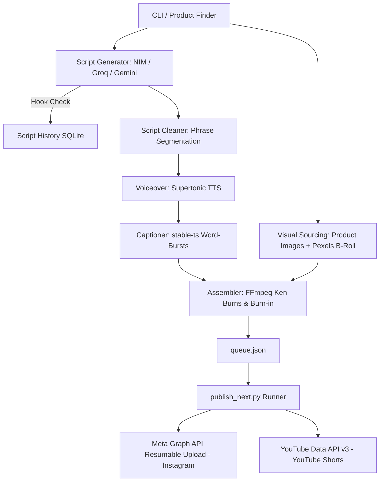

# Yasna Content Pipeline

An autonomous short-form affiliate video creation and multi-platform publishing engine. Given a product name, price, features, and niche, Yasna automatically generates direct-response marketing scripts, checks hook uniqueness via SQLite, synthesizes natural voiceovers, burns high-impact center word-burst captions, applies Ken Burns zoom effects to real product images, and queues videos for automated publishing to Instagram Reels and YouTube Shorts.

---

## 🛠️ Architecture & Design



### 1. Key Modules & Pipeline Flow
1. **`config.py`**: Centralized configuration reading keys, credentials, and render settings from `.env`.
2. **`script_generator.py`**: Multi-provider LLM chain (Groq → NIM → Gemini) writing 30-second direct-response ad copy with DM/bio CTA.
3. **`script_history.py`**: SQLite database (`script_history.db`) tracking hook similarity to prevent duplicate content angles across runs.
4. **`script_cleaner.py`**: Cleans and segments scripts into breath-phrases for TTS.
5. **`voiceover.py`**: Synthesizes local audio using `supertonic` ONNX engine.
6. **`captioner.py`**: Uses `stable-ts` (Whisper) to export single/two-word burst captions aligned in the middle-center third of the screen.
7. **`visuals.py`**: Downloads real product images (Amazon CDN) as primary visuals, and queries Pexels Video API for secondary B-roll cutaways.
8. **`assembler.py`**: Full FFmpeg video assembly combining Ken Burns zoompan filters on product images, B-roll clips, voiceover audio, ASS captions, and final price-banner overlay.
9. **`amazon_affiliate.py` & `storefront.py`**: Translates products into affiliate tracking links and updates a hosted HTML storefront page (`store.html`).
10. **`main.py`**: Local generation entrypoint. Builds the complete video and appends metadata to `queue.json` without publishing directly.
11. **`uploader_instagram.py`**: Meta Graph API publisher using resumable binary video uploads to `rupload.facebook.com`.
12. **`uploader_youtube.py`**: YouTube Data API v3 publisher with automated OAuth token refresh.
13. **`publish_next.py`**: Publishing runner. Reads `queue.json`, publishes the oldest pending video to Instagram and YouTube, then deletes the local video MP4 from disk.
14. **`.github/workflows/publish_queue.yml`**: GitHub Actions workflow running `publish_next.py` twice daily via cron schedule or manual dispatch.
15. **`webhook_listener.py`**: Standalone Flask application for real-time Instagram comment-to-DM automation. Listens for webhooks and sends Private Replies using the Meta Graph API when trigger keywords are matched.

---

## 📡 Webhook Listener (Comment-to-DM Automation)

The `webhook_listener.py` module is a separate, always-on service designed to respond to Instagram comments in real-time. It is **not** run by GitHub Actions.

### Deployment & Setup
1. Deploy `webhook_listener.py` to an always-on host like **Render**, **Railway**, or **Heroku**.
2. Configure the environment variables (`IG_ACCESS_TOKEN`, `IG_USER_ID`, and `WEBHOOK_VERIFY_TOKEN`) in your host's dashboard.
3. Once deployed, take your public application URL (e.g., `https://your-app.onrender.com/webhook`) and register it in the **Meta App Dashboard**:
   - Go to Webhooks -> Instagram.
   - Subscribe to the `comments` field.
   - Provide your chosen `WEBHOOK_VERIFY_TOKEN` to complete the verification handshake.

---

## 🚀 Setup & Installation

### 1. Prerequisites
- **Python**: 3.10 or 3.11 recommended.
- **FFmpeg**: Must be available on system PATH.

### 2. Installation Steps
1. Create and activate virtual environment:
   ```bash
   python -m venv venv
   # Windows:
   venv\Scripts\activate
   ```
2. Install dependencies:
   ```bash
   pip install -r requirements.txt
   ```

### 3. Environment Configuration
Copy `.env.example` to `.env` and fill in your keys:
```bash
cp .env.example .env
```

---

## 💻 Usage

### Generate a Video (Local Queue Creation)
To generate a video ad and add it to `queue.json`:
```bash
python main.py
```
Or specify a custom product:
```bash
python main.py \
  --product "Smart Kitchen Pepper Grinder" \
  --price "$24.99" \
  --features "one-touch button, USB rechargeable, adjustable coarseness" \
  --niche "kitchen gadgets"
```

### Publish Next Queued Video
To process and publish the oldest queued video:
```bash
python publish_next.py
```
