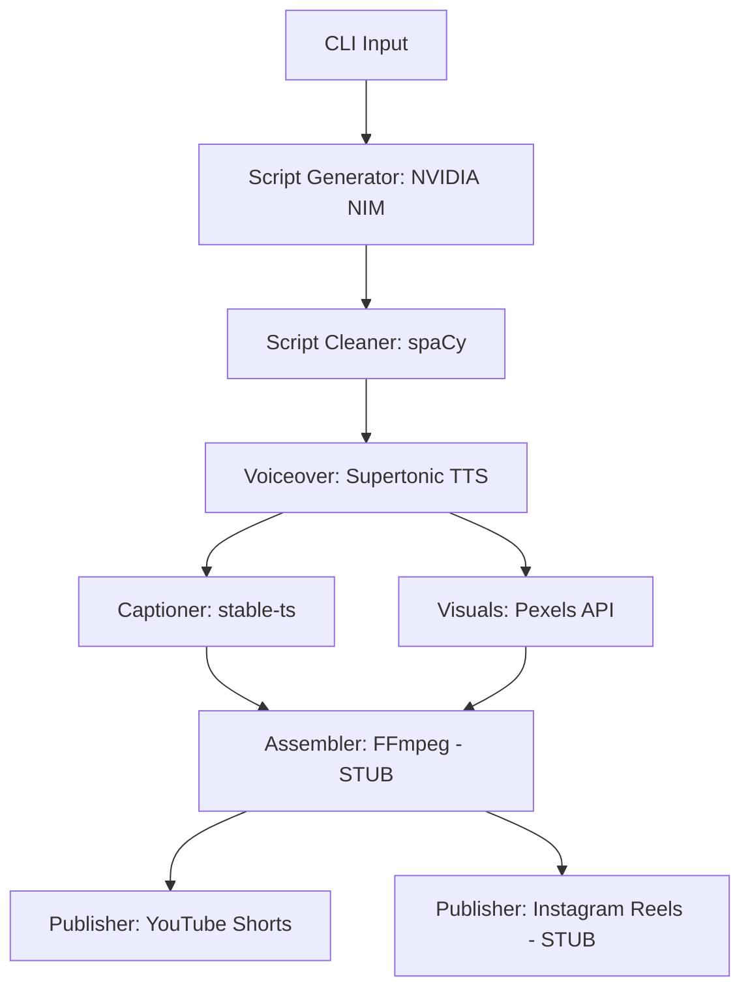

# Yasna Content Pipeline

An automated short-form affiliate video creation and multi-platform publishing pipeline. Given a product name, price, features, and niche, Yasna automatically generates engaging copy, synthesizes natural voiceover, extracts word-level subtitles, gathers matching portrait visuals, and facilitates automated publishing.

---

## 🛠️ Architecture & Design



### 1. Key Modules & Pipeline Flow
1. **`config.py`**: Reads all keys, secrets, paths, and aesthetic settings from `.env`.
2. **`script_generator.py`**: Connects to the NVIDIA NIM API (OpenAI-compatible chat completions) to generate short vertical-focused ad copywriting. Uses a custom direct-response marketing prompt and exponential backoff retry logic.
3. **`script_cleaner.py`**: Employs spaCy (`en_core_web_sm`) to segment the script into distinct sentences, strips conversational LLM fluff, and splits sentences exceeding 12 words to maintain a rapid visual pace.
4. **`voiceover.py`**: Integrates the `supertonic` ONNX local engine to generate a WAV file, merging synthesized sentence segments with 0.3s pauses.
5. **`captioner.py`**: Invokes `stable-ts` (Whisper) to transcribe the audio, extracting word-level timestamps and exporting an Advanced SubStation Alpha (`.ass`) caption file styled for a 1080x1920 viewport.
6. **`visuals.py`**: Connects to the Pexels Video Search API to locate and download vertical (portrait-oriented) stock footage based on niche terms, with a built-in generic fallback mechanism.
7. **`assembler.py` (STUB)**: Formulates the specifications for merging video clips, burning in `.ass` captions, overlays, and final trimming.
8. **`uploader_youtube.py`**: Connects to YouTube Data API v3 to publish the video as a YouTube Short. Handles automated session token refreshment.
9. **`uploader_instagram.py` (STUB)**: Outlines the Graph API container upload flow.
10. **`main.py`**: Command-line entrypoint that coordinates the entire workflow sequentially.

---

## 📝 Documented Assumptions

1. **NVIDIA NIM Endpoint**: Assumes the OpenAI-compatible endpoint URL `https://integrate.api.nvidia.com/v1`.
2. **Audio Sample Rate**: Assumes `supertonic` synthesizes audio at `44100Hz` for padding calculations.
3. **Pexels Orientation**: Filters strictly for `orientation: portrait` to match standard mobile formats.
4. **YouTube Session**: Assumes the user has registered their application in the Google Developer Console, placed the `client_secret.json` at the configured path, and performed the initial login token generation to output `token.json`.
5. **Stubs**: In Stage 1, `assembler.py` and `uploader_instagram.py` will raise a `NotImplementedError` if run. `main.py` catches this gracefully and completes the run up to the stub point.

---

## 🚀 Setup & Installation

### 1. Prerequisites
- **Python**: Version 3.10 or 3.11 recommended.
- **FFmpeg**: Required on the system PATH for audio synthesis, Whisper transcription, and caption generation.

### 2. Installation Steps
1. Create and activate a virtual environment:
   ```bash
   python -m venv venv
   # On Windows:
   venv\Scripts\activate
   ```
2. Install dependencies:
   ```bash
   pip install -r requirements.txt
   ```
3. Initialize the spaCy language model (the cleaner will also download this automatically if missing):
   ```bash
   python -m spacy download en_core_web_sm
   ```

### 3. Environment Configuration
Copy `.env.example` to `.env` and fill in your details:
```bash
cp .env.example .env
```
Ensure `NIM_API_KEY` and `PEXELS_API_KEY` are provided.

---

## 💻 Example Command

To execute a local pipeline test (without attempting uploads):
```bash
python main.py \
  --product "Smart Kitchen Pepper Grinder" \
  --price "$24.99" \
  --features "one-touch button, USB rechargeable, adjustable coarseness" \
  --niche "kitchen gadgets"
```

To execute and trigger a YouTube Shorts publish attempt:
```bash
python main.py \
  --product "Smart Kitchen Pepper Grinder" \
  --price "$24.99" \
  --features "one-touch button, USB rechargeable, adjustable coarseness" \
  --niche "kitchen gadgets" \
  --publish youtube
```
*(Note: Uploading requires a valid `token.json` file generated for your YouTube account.)*
